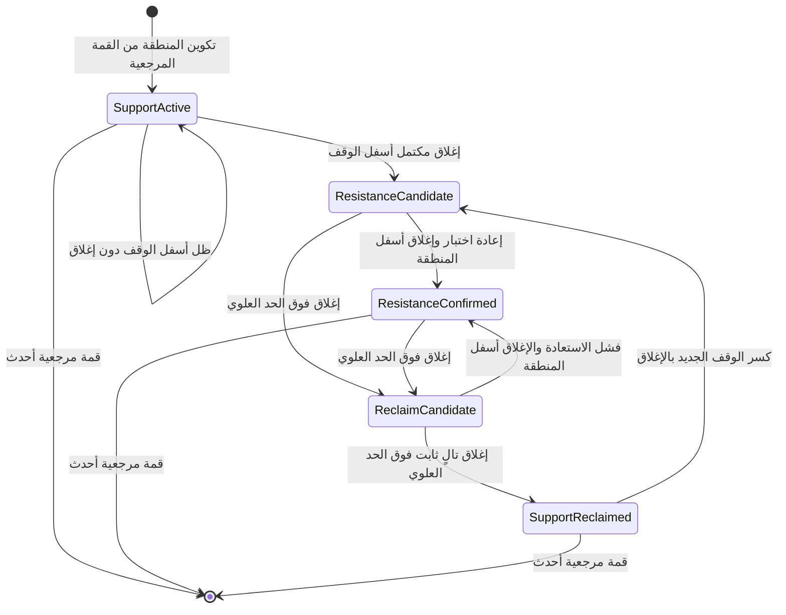

# حالة تنفيذ منصة كيمي — محدثة 2026-08-04

## مصدر الحقيقة

- المستودع: `https://github.com/KHALAF2006/kimi.git`
- الفرع المعتمد للإنتاج: `main`
- مجلد العمل: `C:\Users\khala\Desktop\SAUDI MARKET\kimi`
- تطبيق Base44: `6a600ea2afc36e37cea9e384`
- رابط الإنتاج: `https://neat-smart-ops-flow.base44.app`

## الحالة الحالية

- منصة كاملة بواجهة React وخلفية Base44 وتسجيل دخول وجلسات عملاء واشتراكات وصلاحيات إدارية.
- السوق السعودي الرئيسي مقيد بكتالوج رسمي من 270 شركة.
- القراءة العامة للسوق والشارت والتنبيهات تعتمد التخزين نفسه، مع دورة تحديث مجدولة كل 15 دقيقة ودورتي إغلاق.
- الواجهة تعرض وقت البيانات ووقت وصولها ونسبة التغطية وحالة الجلسة، دون عرض رسائل بيئة البناء للعميل.
- 46 كياناً و26 دالة خلفية موجودة في مصدر المشروع عند هذا التحديث.

## استعادة أعطال الإنتاج — 2026-07-28

- عولج تسرب `functions_version` من رابط معاينة Base44 إلى التخزين المحلي؛ النسخة المنشورة لا تعيد استخدام إصدار خلفي قديم بعد الآن.
- أضيف تسجيل خلفي آمن لأخطاء `marketRead` يشمل الطلب الفني فقط، دون الجلسات أو الأسرار.
- أعيدت شموع فاصل الأسبوع وفاصل الشهر، وثبت ذلك داخل جلسة المالك على رابط الإنتاج.
- أعيد فتح ملف القطاع ومؤشره وقائمة شركاته؛ اختبر قطاع البنوك وظهرت شركاته العشر دون رسالة فشل.
- أعيد شريط الرسم إلى صف أفقي واحد قابل للتمرير، بدلاً من تمدده فوق مساحة الشارت.
- زر إعادة الرسم يعيد مقياس السعر والزمن وأحجام نوافذ السعر والحجم وRSI.
- فرع الاستعادة: `fix/production-chart-regression`.

## تحديث القطاعات والشارت وأدوات الرسم

- الضغط على القطاع يفتح ملف القطاع نفسه، وليس فلتر الشركات فقط.
- ملف القطاع يعرض مؤشر قطاع مرجح، نسبة تغيره، عدد الشركات والمرتفعة والمنخفضة والثابتة.
- شارت القطاع يُبنى في الخلفية من شموع شركاته ويستخدم قاعدة مؤشر 1000، ثم يعرض مناطق المستثمر وRSI والحجم.
- قائمة شركات القطاع تظهر داخل ملف القطاع ويمكن فتح أي شركة منها مباشرة.
- محور السعر يدعم السحب الرأسي وإعادة الضبط بالنقر المزدوج، ومحور الزمن مستقل بصرياً ويدعم السحب والتكبير.
- عجلة الفأرة والتكبير باللمس مفعّلان من دورة التفاعل الرسمية لمكتبة الرسم.
- الفرشاة والمنحنى يستخدمان مساراً انسيابياً مع أخذ عينات للنقاط، ولا تُرسم مقابض على كل نقطة للفرشاة.
- شريط خصائص الرسم قابل للسحب ويحفظ موقعه.
- النسخ واللصق يستخدمان حافظة داخلية دائمة، ويستفيدان من حافظة المتصفح عند السماح بها، ثم ينشئان نسخة مستقلة من الخلفية.
- أضيف إخفاء وإظهار جميع الرسومات، ومسح جميع الرسومات، وإخفاء وإظهار جميع المؤشرات، وإخفاء وإظهار الرسومات والمؤشرات معاً.
- عمليات الرسومات الجماعية محمية بالجلسة والملكية وتُسجل في سجل التدقيق.

## التحقق الآلي

- `npm run typecheck`
- `npm run lint`
- `npm test`
- `npm run build`
- `git diff --check`

تغطي اختبارات المشروع:

- تطابق 270 رمزاً وعدم تكرارها.
- دورات تحديث ربع الساعة وحساب التغير والإغلاق السابق.
- امتداد القنوات الصاعدة والهابطة وشبه العمودية إلى حدود الرسم.
- أدوات قياس السعر والزمن.
- ملكية الرسومات والتنبيهات والنسخ والعمليات الجماعية.
- مسارات القطاع ومؤشره وشركاته.
- سحب محوري السعر والزمن وأوامر الإخفاء الشاملة.
- خلو حالة بيانات العميل من عبارات بيئة البناء المحذوفة.

## حدود التنفيذ الحالية

- لا تُحذف كيانات أو سجلات Base44 القديمة ضمن هذا التحديث.
- لا تُنشأ أسعار تقديرية عند فقد دورة؛ تبقى آخر قيمة مخزنة مع وقتها الحقيقي.
- اختبار اللمس النهائي يحتاج جهاز لمس فعلي، بينما تغطي الاختبارات الحالية الماوس ولوحة المفاتيح وبناء الهاتف المتجاوب.

## تسلسل النشر

1. نجاح جميع الاختبارات محلياً.
2. دفع فرع التنفيذ إلى GitHub ودمجه في `main`.
3. نشر الدالتين `marketRead` و`chartDrawings` ثم نشر الواجهة إلى تطبيق Base44 المحدد.
4. اختبار رحلة المالك على رابط الإنتاج: فتح قطاع، فتح شركة، تكبير المحاور، رسم ونسخ ولصق، ثم الإخفاء والإظهار والمسح.

## تحديث محرك الشموع والإشارات — 2026-07-30

- أصبح مفتاح شمعة الربع ساعة هو وقت بداية الربع، وليس الوقت الخام القادم من المصدر.
- يمنع المحرك حفظ شمعتين للربع نفسه، ويفضل الشمعة الواقعة على بداية الربع على السجل الأولي المنحرف زمنيًا.
- يطبق مسار القراءة المعالجة نفسها على السجلات القديمة، لذلك لا يعيد الشارت تجميع التكرارات كأنها شموع مستقلة.
- أضيفت عملية يومية بعد الإغلاق عند 15:45 بتوقيت الرياض:
  - تثبت شمعة اليوم من شموع الربع ساعة والسعر النهائي.
  - تحدث الإسقاط الأسبوعي ابتداءً من الأحد.
  - تحدث الإسقاط الشهري وفق تاريخ جلسة الرياض.
  - تحفظ الناتج تراكميًا ولا تعيد طلب التاريخ في كل مشاهدة.
- الماسح يفحص الفترة الحالية المخزنة وآخر فترتين قبلها لكل من اليومي والأسبوعي والشهري، ويبيّن إن كانت الفترة الحالية ما زالت قيد التكوين.
- أضيف متوسط بسيط 20 ومتوسط بسيط 50 إلى الشارت مع تحكم مستقل في الإظهار والإخفاء.
- أضيف فاحص خلفي وواجهة للبحث عن:
  - بن بار صاعد داخل إحدى مناطق المستثمر.
  - اختراق السعر للمتوسط البسيط 20.
  - اختراق السعر للمتوسط البسيط 50.
  - تقاطع المتوسط البسيط 20 فوق المتوسط البسيط 50.
- أزيلت تسميات حدود ووقف كل منطقة من محور السعر لمنع التداخل، وأصبحت أسماء المناطق مختصرة داخل النطاق مع بقاء بطاقة الأسعار التفصيلية قابلة للإخفاء.
- تسجل عملية الإسقاط اليومية في `IngestionRun` وتظهر نتيجة نجاحها أو فشلها في مراقبة بيانات السوق.
- أصبح تقدير أتمتات يوم التداول 24 تشغيلًا، أي نحو 528 تشغيلًا في شهر من 22 جلسة.

### تحقق هذا التحديث

- نجحت اختبارات منع تكرار ربع الساعة واختيار السجل النهائي.
- نجحت حدود الأسبوع السعودي من الأحد، وحدود الشهر بتوقيت الرياض.
- نجحت اختبارات المتوسطين وإشارات الاختراق والتقاطع وشكل البن بار.
- نجحت اختبارات المشروع والأنواع والتنبيه والبناء الإنتاجي.
- نجحت معاينة البناء الإنتاجي محليًا دون تجاوز أفقي على سطح المكتب.
- لم تحذف أو تعدل سجلات إنتاج قديمة أثناء التطوير؛ الإصلاح الجديد يحمي القراءة والكتابة، ويحتاج تشغيل الإسقاط بعد المزامنة لتكوين الجداول والإشارات الجديدة.

## تحديث تجربة الشارت — 2026-07-31

- أصبح اختيار نوع الشموع حصريًا: عادية أو مفرغة أو هايكن آشي، ولا تُرسم الأنواع فوق بعضها.
- تُحسب شموع هايكن آشي للعرض فقط، بينما تبقى المتوسطات والإشارات والتنبيهات مبنية على شموع الافتتاح والأعلى والأدنى والإغلاق الأصلية، ويظل السعر الفعلي ظاهرًا على المحور.
- أضيفت لوحة إعدادات للشارت تفتح من زر واضح أو بالنقر المزدوج داخل مساحة السعر، وتشمل الخلفية المستقلة عن ثيم الموقع وألوان الشموع والشبكة.
- جُمعت المؤشرات في قائمة واحدة؛ إغلاق القائمة لا يخفي المؤشرات المفعلة.
- أصبح المتوسطان قابلين لتغيير الفترة واللون وسماكة الخط من 1 إلى 5، ويتغير الاسم المعروض تلقائيًا مع الفترة.
- استُبدلت رسائل المتصفح الأصلية عند حذف الرسومات بنافذة تأكيد احترافية تدعم لوحة المفاتيح وتوضح حذف التنبيه المرتبط.
- تُحفظ إعدادات الشارت محليًا فورًا، وتُزامن مع ملف العميل عبر وظيفة خلفية محمية بالجلسة وموثقة في سجل التدقيق.
- أضيفت اختبارات حساب هايكن آشي وقواعد الشموع المفرغة وحصرية نوع العرض وحماية حفظ الإعدادات.

## استعادة الوصول ووضوح قائمة المؤشرات — 2026-07-31

- ظهر بعد النشر أن إعداد ظهور تطبيق Base44 أصبح `Private`، فكان رابط الإنتاج يحوّل إلى تسجيل دخول المنصة قبل تحميل كيمي ويصل إلى صفحة Google 403.
- أُعيد إعداد الظهور في تطبيق الإنتاج إلى `Public` بما يطابق وجود صفحة Landing عامة، مع بقاء صفحات العميل والإدارة محمية بحارس الدخول والجلسة والصلاحيات الخلفية داخل التطبيق.
- كان موضع قائمة المؤشرات يستخدم `inline-end`؛ وفي العربية كان ذلك يفتح القائمة خارج الحافة اليمنى ويقص أسماء المؤشرات.
- أصبحت قائمة المؤشرات وقائمة نوع الشموع تفتحان إلى داخل مساحة العرض بحسب اتجاه اللغة، مع حد عرض متجاوب وحد ارتفاع قابل للتمرير، وبقاء أسماء المؤشرات ملتفة وقابلة للقراءة.
- أضيف تحقق آلي لاتجاه القائمتين ووضوح أسماء المؤشرات، ونجحت اختبارات الأنواع والتنبيه والمشروع والبناء الإنتاجي.

### نتيجة النشر والتحقق

- الالتزام الذي أعاد الوصول العام وأصلح اتجاه القائمة:
  - `37684f7962be87a067d5053b56dec206d0de984e`
- الالتزام النهائي الذي منع تجاوز قائمة المؤشرات حافة الهاتف:
  - `147e3845d2a4d0f68501c14862b9b7e40f394f86`
- طابق الالتزام النهائي فرع `main` ومرجع `origin/main`، ووصل إلى بيئة تطبيق Base44 الصحيحة.
- نجحت الأوامر التالية محليًا وداخل بيئة Base44:
  - `npm run typecheck`
  - `npm run lint`
  - `npm test`
  - `npm run build`
  - `git diff --check`
- اختُبرت قائمة المؤشرات على عروض 1551 و1280 و768 و390 بكسل، وظهرت أسماء المؤشرات الخمسة كاملة داخل مساحة الشاشة.
- اختُبر رابط الإنتاج دون جلسة مستخدم، وأعاد `HTTP 200` وعرض صفحة كيمي العامة دون تحويل إلى Google أو ظهور خطأ 403.
- تحقق أن ملف الأنماط المنشور نفسه يحتوي قاعدة الهاتف وقاعدة قائمة المؤشرات.
- لم تُعدّل بيانات السوق أو الأسعار أو الشموع أو وظائف المزامنة ضمن إصلاح الوصول والقائمة.

### نقطة الاستئناف القادمة

1. فتح رابط الإنتاج بجلسة المالك واختبار قائمة المؤشرات داخل صفحة شركة فعلية.
2. اختبار وضع ملء الشاشة الأصلي من متصفح المستخدم؛ الاختبار الآلي غطى مقاس شاشة كاملة، لكن بيئة الاختبار لم تسمح بتفعيل واجهة ملء الشاشة الأصلية.
3. مراجعة إعدادات كل مؤشر من القائمة: الإظهار والإخفاء، اللون، الفترة، السماكة والحفظ بعد إعادة تحميل الصفحة.
4. التأكد من بقاء ظهور التطبيق `Public` بعد أي نشر لاحق، مع استمرار حماية صفحات العميل والإدارة من داخل التطبيق.
5. بعد نجاح الرحلة المباشرة، الانتقال إلى بقية مهام الشارت وبيانات السوق دون إعادة تنفيذ الإصلاحات المكتملة.

## تنظيف تطبيقات Base44 المكررة — 2026-07-31

- حُذف تطبيق `كيمي | Kimi` ذي المعرف `6a6663f2143efba5ec81d440` بعد التحقق أنه نسخة قديمة مستقلة وغير متصلة بمستودع GitHub المعتمد.
- حُذف تطبيق `منصة كيمي التجريبية` ذي المعرف `6a666859f49b758f5d77f873` بعد التحقق أنه مشروع هيكلي بلا وظائف خلفية أو كيانات بيانات.
- بقي تطبيق واحد فقط باسم `منصة كيمي` ذي المعرف `6a600ea2afc36e37cea9e384`.
- تحقق أن التطبيق المتبقي متصل بالمستودع `KHALAF2006/kimi` وأن رقم التزامه يطابق الفرع `main` وقت الحذف.
- تحقق أن رابط الإنتاج `https://neat-smart-ops-flow.base44.app` بقي يعمل ويعيد `HTTP 200` بعد حذف التطبيقين المكررين.
- لم يتغير كود الموقع أو بيانات تطبيق الإنتاج أو إعداداته أو رابط نشره ضمن عملية التنظيف.

## إصلاح جلسة التبويب الجديد ونافذة الماسح — 2026-07-31

- ثبت أن Base44 SDK يحفظ رمز الدخول في التخزين المحلي المشترك بين تبويبات الأصل نفسه، لكن معامل `clear_access_token` المؤقت كان يُحفظ محليًا ثم يعيد مسح الرمز عند تحميل تبويب جديد.
- أصبح معامل المسح لمرة واحدة فقط، ويُحذف أثره القديم أثناء الإقلاع، مع بقاء انتهاء الجلسة وإلغائها مفروضين في الخادم.
- ثبت أن محرر Base44 يعرض المعاينة داخل إطار ذي تخزين مقسّم عن التبويب المستقل؛ لذلك أضيف تمرير جلسة محدود بنطاقات معاينة Base44 فقط عند فتح رابط داخلي في تبويب جديد، مع تمرير نسخة الواجهة والخلفية وبيئة بيانات المعاينة نفسها، ثم يُمسح جزء المصادقة من الرابط فورًا. يُرفض أي عنوان خلفية لا يطابق مضيف معاينة Base44 الحالي، وروابط الإنتاج لا تحمل هذا التمرير وتستمر عبر التخزين المشترك للأصل نفسه.
- وُحّدت جميع روابط التنقل الداخلية المرئية في التخطيط وصفحات السوق والمتابعة والتنبيهات والإدارة والتسجيل على مكوّن رابط واحد يدعم النقر العادي والتبويب الجديد دون تغيير مسارات الوصول أو صلاحيات الخادم.
- أصبح محرك الإشارات يبني نافذة عامة من آخر ثلاث شموع لكل فاصل بدل حفظ نتيجة الشمعة الأخيرة وحدها.
- يفحص الماسح الفترة الحالية المخزنة وفترتين قبلها في اليومي والأسبوعي والشهري، وتنطبق القاعدة نفسها على Pin Bar والشمعة البالعة وإشارات المناطق واختراقات وتقاطعات المتوسطات.
- تعيد الخلفية الشمعة المطابقة نفسها مع تاريخها وحالة اكتمال الفترة، وتعرض الواجهة تاريخ الإشارة في بطاقات النتائج وجدول السوق.
- أزيل شرط واجهة قديم كان يعيد تصفية استجابة الخادم عبر كائن اللقطة الكامل؛ أصبحت الواجهة تعتمد `screener_match` المثبت من الخادم، فلا تُمسح نتائج صحيحة عند اختصار الحقول المنقولة.
- أصلح الإسقاط اليومي دمج كل جلسات الربع ساعة المحفوظة قبل حساب اليومي والأسبوعي والشهري؛ لم يعد يقتصر على التاريخ اليومي القديم مع جلسة اليوم فقط.
- ثبتت حالة السهم 1111 من بيانات Base44 الفعلية: شمعة 29 يوليو 2026 Pin Bar صاعدة، بينما شمعة 30 يوليو ليست Pin Bar؛ لذلك يجب أن يظهر السهم ضمن نافذة آخر ثلاث جلسات مع تاريخ 29 يوليو.
- رُفعت نسخة معادلة الإشارات إلى `technical-signals-v3` حتى لا تمنع نتيجة تشغيل قديم إعادة الإسقاط المطلوب.

### تحقق هذا الإصلاح

- نجح اختبار ثابت لبيانات 1111 ولتحديد الإشارة في الإزاحة الثانية داخل نافذة الثلاث شموع.
- نجحت اختبارات `npm test` و`npm run lint` و`npm run typecheck` و`npm run build` و`git diff --check`.
- نُشر الإصدار الثالث وشُغّل الإسقاط الفني على 270 شركة: حُدثت 809 مجموعات شموع و810 لقطات إشارات دون فشل دفعات، وبقيت النتيجة `degraded` فقط لأن السهم 2210 لا يملك سعر إغلاق نهائيًا متاحًا.
- أعاد طلب الماسح المحمي 84 نتيجة Pin Bar يومية، وتأكد وجود 1111 مع شمعة المطابقة الصاعدة بتاريخ 29 يوليو 2026 وإزاحة شمعة واحدة.

## الأرشيف التاريخي الدائم — 2026-07-31

- أضيف نطاق `تاريخي` للفواصل اليومية والأسبوعية والشهرية.
- أضيف مسار خلفي محمي يفضّل مصدر سهمك عند وجود مفتاحه، ويستخدم حاليًا شموع Yahoo Finance اليومية العامة للسوق السعودي عند غياب المفتاح، مع التحقق من الفترة والأسعار والتكرار وحالة اكتمال استجابة المصدر.
- تُقسم الشموع إلى ملفات سنوية داخل `CandleChunk`، مع بصمة تحقق وسجل مستقل لكل شركة في `HistoricalCandleSync`.
- الشركة التي اكتمل أرشيفها لا تُطلب من المزود مرة أخرى؛ أي تشغيل لاحق يستأنف الشركات الناقصة أو الفاشلة فقط.
- يبني الخادم الأسبوعي والشهري من اليومي المخزن، ويعطي شمعة اليوم الحالية أولوية على نسخة الأرشيف عند تطابق التاريخ.
- أزيل حد 500 شمعة من حساب القمة المرجعية ومناطق المستثمر، وأصبح الحساب يستخدم كل التاريخ المخزن.
- تعرض لوحة تشغيل المالك عدد الشركات المكتملة والناقصة والفاشلة وعدد الشموع المحفوظة، مع تشغيل يدوي مراقب لاستكمال الناقص.
- إذا كان أرشيف شركة غير مكتمل، يصرح الشارت بذلك عند اختيار النطاق التاريخي ولا يصف الجزء الموجود بأنه كامل.
- أصبحت قائمة نوع الشموع في صف مستقل تحت رأس الشارت، وتُغلق قوائم المؤشرات والشموع الانعكاسية بالتبادل لمنع أي تداخل.

### تحقق هذا التحديث

- نجحت اختبارات التعديل السعري، رفض بيانات الأسعار غير المتسقة، دمج التاريخ المكرر، والتقسيم السنوي.
- نجح اختبار استخدام 650 شمعة في حساب القمة المرجعية دون القطع عند 500.
- نجحت اختبارات المشروع والأنواع والتنبيه والبناء الإنتاجي وارتباط التطبيق بالمستودع.
- اكتمل الاستيراد الفعلي إلى قاعدة Base44 في أربع دورات استئنافية دون إعادة طلب الشركات المكتملة. أعادت دورة التحقق النهائية `all_history_already_complete` لعدد 270 شركة.
- حالة الأرشيف المثبتة من وظيفة الخادم بعد الاستيراد: 270 مكتملة، 0 جزئية، 0 فاشلة، وإجمالي 727,290 شمعة يومية محفوظة.
- تحقق الخادم من تغطية المصدر منذ أول تاريخ متاح لكل شركة. عينة 1111 مخزنة من 12 ديسمبر 2021 حتى 30 يوليو 2026، وتُشتق منها 238 شمعة أسبوعية و56 شمعة شهرية عبر محرك الدمج نفسه المستخدم في مسار قراءة الشارت.
- عينة الشركات 1010 و1111 و1211 و1321 و2010 و2222 و4001 و4323 اجتازت حالة `complete` و`coverage_verified` مع وجود يومي وأسبوعي وشهري فعلي.
- أضيف وضع حالة محمي لوظيفة الأرشيف، متاح لجلسة المالك أو لهوية مدير Base44 الموثوقة فقط، حتى يمكن فحص الاكتمال وعدد الشموع دون فتح بيانات التشغيل للعامة.
- نُشرت وظيفة `historicalCandleBackfill` المجمعة ذاتيًا إلى التطبيق `6a600ea2afc36e37cea9e384`، بعد إصلاح رفض Base44 للاستيرادات الخارجة من مجلد الوظيفة.

## تنظيف مخططات كيانات Base44 — 2026-08-01

- كان المستودع يحتوي 92 ملف مخطط تمثل 46 اسم كيان فقط؛ كل اسم ظهر مرتين بمحتوى متطابق دلاليًا.
- أبقت المعالجة 46 ملفًا فقط، واحتفظت بأسماء الملفات المطابقة لهويات الكيانات التي يولدها تطبيق Base44 نفسه، مثل `Instrument.jsonc` و`CandleChunk.jsonc` و`HistoricalCandleSync.jsonc`.
- أثبتت تجربة المزامنة أن استخدام أسماء الملفات الصغيرة ذات الشرطات وحدها يجعل وظائف التطبيق تفقد الوصول إلى `Instrument`. أُوقفت النتيجة فورًا، وأعيدت هويات Base44 الفعلية ثم أُعيد فحص الأرشيف.
- لم تُنفذ أي عملية حذف سجلات أو `Delete All`. تؤكد وثائق Base44 أن `entities push` مزامنة كاملة، وأن حذف المخطط لا يحذف السجلات تلقائيًا لكنه يمنع الوصول إليها حتى استعادة المخطط:
  - `https://docs.base44.com/developers/references/cli/commands/entities-push`
  - `https://docs.base44.com/Building-your-app/Managing-your-app-data`
- قبل التنظيف وبعد الاستعادة كانت بصمة الأرشيف متطابقة: 270 شركة مكتملة، 0 جزئية، 0 فاشلة، و727,290 شمعة يومية محفوظة.
- اجتازت عينة 1010 و1111 و1211 و1321 و2010 و2222 و4001 و4323 حالة `complete` و`coverage_verified`، مع تطابق أعداد الشموع اليومية والأسبوعية والشهرية وتواريخ البداية والنهاية قبل المعالجة وبعدها.
- نجحت مزامنة 46 كيانًا إلى التطبيق `6a600ea2afc36e37cea9e384`، وبقيت وظائف الخادم المنشورة وعددها 22 موجودة، وعاد رابط الإنتاج بحالة `HTTP 200`.
- التزام التنظيف الأول: `ad753d719a0a1e2b1d652988fbd6e5a33219a727`.
- التزام تثبيت هويات Base44 والاستعادة: `d5f2b54f224ae6e090cf516babb9ab166f332078`.

### تحقق هذا التنظيف

- نجحت فحوص عدد الملفات والأسماء: 46 ملفًا، 46 اسمًا فريدًا، ولا أسماء مكررة.
- نجحت `npm run typecheck` و`npm run lint` و`node scripts/verify-market-data.mjs` و`npm run build` و`git diff --check`.
- بقي فشلان سابقان غير ناتجين عن التنظيف: اختبار `verify-project.mjs` يتوقع ترويسة خدمة لم تعد موجودة في تعديلات Base44 الأخيرة، وفحص `build-app-editor-functions.mjs --check` يجد أن `historicalCandleBackfill/entry.ts` لا يطابق مصدره بعد تعديلات Base44. لم تُعدّل وظائف الخادم ضمن تنظيف المخططات.
- تعذر اختبار `marketRead` من جلسة CLI لأنه يتطلب جلسة جهاز تطبيق فعالة، بينما نجح فحص الأرشيف المحمي بهوية مدير Base44.

## دورة حياة مناطق الدعم والمقاومة — 2026-08-03

### نسخة الاسترجاع

- أُنشئت نسخة قبل التعديل في:
  `C:\Users\khala\Desktop\SAUDI MARKET\backups\kimi\pre-zone-role-reversal-20260803-025848`
- تحتوي حزمة Git كاملة، ونسخة ZIP للكود عند نقطة الاستعادة، ونسخة مستقلة لملفات المناطق، ونسخة مستعادة جرى فتحها والتحقق من التزامها وشجرتها.
- حزمة Git تحمل بصمة SHA-256:
  `5E5C647490BE1DA1C6C5C6529168F533566B2EB19F045DECF7DD992C5726FE06`
- نسخة الكود المضغوطة تحمل بصمة SHA-256:
  `CDDEC3D72BA1EFA8C33BF7D08354AD8E73F86B8E3259AC71332CC9F9C35F4EB4`
- رُفعت نقطة استعادة GitHub مستقلة:
  `backup/pre-zone-role-reversal-20260803-025848`

### السلوك الجديد

- رُفعت نسخة المعادلة إلى `momentum-zones-v2-role-reversal`.
- كل منطقة تحتفظ بهويتها الأصلية، لكن لها دور حالي مستقل: دعم أو مقاومة.
- لا يغيّر اختراق الظل للوقف دور المنطقة؛ يلزم إغلاق شمعة مكتملة أسفل الوقف.
- بعد الكسر بالإغلاق تتحول المنطقة فورًا إلى مقاومة مرشحة، ويتغير اسمها الظاهر إلى اسم مقاومة مناسب، ويختفي خط الوقف القديم من الشارت والبطاقات.
- إذا عاد السعر إلى نطاق المنطقة ثم أغلق أسفل حدها السفلي، تصبح مقاومة مؤكدة.
- إذا أغلق السعر فوق حدها العلوي ثم حافظ الإغلاق التالي فوقه، تستعاد المنطقة كدعم باسم جديد ووقف جديد مشتق من قاع الاستعادة وحد المنطقة.
- كسر المنطقة الثالثة يفعّل المنطقة الرابعة، وكسر الرابعة يفعّل الخامسة، مع بقاء المنطقة المكسورة نفسها كمقاومة.
- عند تكوين قمة مرجعية أحدث تُؤرشف دورة المنطقة السابقة وأحداثها داخل نتيجة المعادلة، بحد أقصى عشرين دورة ضمن اللقطة الحالية.

### مصدر الحقيقة والترابط

- أصبح محرك الخلفية في `base44/shared/momentum.ts` هو سلطة حساب الدور والأحداث.
- مسار `marketRead.chart` يحسب النتيجة من جميع الشموع القانونية المخزنة للفاصل، ولا يجعل الواجهة سلطة ثانية للحساب.
- وظيفة `marketSignalRefresh` تحفظ لقطة `momentum_zones` مستقلة لكل فاصل يومي وأسبوعي وشهري مع نسخة المعادلة ووقت المصدر.
- آخر شمعة أسبوعية أو شهرية غير مكتملة لا تستطيع كسر المنطقة أو استعادتها.
- الماسح لا يعد Pin Bar داخل منطقة مكسورة إشارة دعم؛ يجب أن تكون المنطقة في دور الدعم.
- اختيار لقطة المناطق أصبح مقيدًا بالفاصل المطلوب، ولا يعرض لقطة فاصل آخر عشوائيًا أثناء فتح الشركة.

### اختبارات القبول المنفذة

- ظل أسفل الوقف مع إغلاق فوقه: بقيت المنطقة دعمًا.
- إغلاق أسفل الوقف: تغير الدور إلى مقاومة واختفى الوقف الظاهر وتغير الاسم العربي.
- إعادة اختبار مرفوضة: ثبتت حالة المقاومة المؤكدة.
- إغلاقان فوق الحد العلوي: استعيد الدعم وأنشئ وقف جديد.
- معرفات الأحداث ثابتة وفريدة عند إعادة الحساب.
- اجتازت الأنواع، والفحص الساكن، واختبارات بيانات السوق والمشروع، وتوليد وظائف Base44، والبناء الإنتاجي، وفحص فرق Git.

### حد النشر

- هذا التحديث لا يحذف أي شموع أو أسعار أو كيانات أو سجلات Base44.
- التزام التنفيذ: `b905f1ad13198527209f23bcbf89fdc67017d1fb`، وقد رُفع فرع المراجعة ثم دُمج دفعًا سريعًا في `main` دون كتابة قسرية للتاريخ.
- نُشرت وظيفتا `marketRead` و`marketSignalRefresh` ثم الواجهة على التطبيق `6a600ea2afc36e37cea9e384`.
- أعاد رابط الإنتاج `HTTP 200`، وحمّل أصول الواجهة الجديدة التي تتضمن حقول الدور والاسم المتغير وإخفاء الوقف.
- مسار الشارت يحسب الحالة الجديدة عند الطلب مباشرة من الشموع المخزنة. أما اللقطات اليومية والأسبوعية والشهرية الدائمة فتُحدّثها دورة `marketSignalRefresh` المجدولة بعد الإغلاق.
- لم تكن جلسة المتصفح الآلية مسجلة داخل حساب كيمي، لذلك اقتصر التحقق المرئي المنشور على الصفحة العامة وأصول البناء. يبقى فحص شركة محمية ذات كسر معروف على الفواصل الثلاثة خطوة تحقق مباشرة بحساب المالك، لا شرطًا لصحة البناء أو النشر.

## الشارت المضغوط وإعادة الشموع والمناطق العميقة — 2026-08-03

### الاسترجاع قبل التغيير

- ثُبتت نقطة الاسترجاع المنشورة `backup/pre-chart-replay-and-deep-zones-20260803-034324` قبل أي تعديل في هذه المرحلة.
- نقطة الاسترجاع تعيد الشارت ومعادلة المناطق وإعدادات العميل إلى الالتزام `e6598f04b06e0c53f77c8bccd2281621b83a151a` دون حذف بيانات السوق أو الشموع التاريخية.

### التغيير من الجذور

- أصبح وضع ملء الشاشة يفتح حاوية الشارت وحدها بارتفاع نافذة المتصفح، بدل فتح صفحة الشركة كاملة؛ لذلك لا يعود المستخدم مضطرًا لتمرير أقسام الشركة أثناء تحليل الشارت.
- صُغرت أيقونات وأزرار وفواصل ونطاقات الشارت مع الحفاظ على مساحة لمس وقراءة واضحة، وصُغرت نافذتا الحجم وRSI لتقليل التمرير دون دمجهما مع مقياس السعر.
- نُقلت قائمة نوع الشموع إلى قائمة منبثقة مرتبطة بزرها، فلا تزيد ارتفاع الشارت ولا تتداخل مع المؤشرات أو الشموع الانعكاسية.
- يظهر في رأس كل شارت رمز الشركة بالأرقام الإنجليزية مع اسمها، ويظهران داخل مساحة الشارت كعلامة مائية أصلية من محرك الرسم.
- أضيف خيار محفوظ في ملف العميل لإظهار العلامة المائية أو إخفائها، وتستمر صلاحيات الحفظ والجلسة وسجل التدقيق الحالي دون فتح مسار كتابة مباشر من الواجهة.
- أضيف محرك `Bar Replay` يخفي كل الشموع اللاحقة لنقطة البداية المختارة، ويعيد حساب الشموع المعروضة والمتوسطات وRSI والشموع الانعكاسية والمناطق من الجزء الظاهر فقط حتى لا تتسرب بيانات المستقبل.
- يبدأ المستخدم من أيقونة إعادة الشموع ثم يختار شمعة البداية على خط زمني أزرق عمودي، وبعدها يستطيع التشغيل والإيقاف والتقدم والرجوع شمعة واحدة وتغيير نقطة البداية والعودة إلى آخر شمعة.
- السرعات المنفذة هي 0.01 و3 و5 و10 ثوانٍ لكل شمعة. قيمة 0.01 ثانية تساوي 10 مللي ثانية برمجيًا، وقد يحد المتصفح معدل التنفيذ الفعلي لحماية الأداء.
- رُفعت معادلة المناطق إلى `momentum-zones-v3-deep-cycle`، وأضيفت منطقتان متتاليتان من القمة المرجعية نفسها:
  - `قاع ثلاث سنوات`: نطاق هبوط 75% إلى 80% بلون وردي.
  - `منطقة خمس سنوات`: نطاق هبوط 85% إلى 90% بلون كهرماني.
- لا تظهر المنطقة السادسة إلا بعد كسر وقف المنطقة السنوية، ولا تظهر السابعة إلا بعد كسر منطقة الثلاث سنوات؛ وتخضعان لنفس دورة التحول من دعم إلى مقاومة ثم الاستعادة التي تطبقها المناطق السابقة.
- تسميتا ثلاث وخمس سنوات تصفان مرحلتي التواتر العميق في المعادلة الحالية وليستا حساب أدنى سعر داخل نافذة تقويمية مستقلة؛ مصدر الحقيقة يبقى القمة المرجعية وجميع الشموع القانونية المخزنة.

### اختبارات القبول

- نجح اختبار تسلسل تفعيل المنطقتين العميقتين وتحول منطقة الثلاث سنوات إلى مقاومة بعد كسرها بالإغلاق.
- نجح اختبار اختلاف ألوان المنطقتين وثبات اسميهما العربيين وترتيب السعر الصارم بين أعلى المنطقة وأسفلها ووقفها.
- نجح اختبار سرعات إعادة الشموع الأربع، اختيار مؤشر البداية، إخفاء كل المستقبل، الرجوع والتقدم ومنع تجاوز أول وآخر شمعة.
- نجح التحقق من بقاء مناطق السوق الحية من سلطة الخادم، وقصر إعادة الحساب في المتصفح على جلسة إعادة الشموع التاريخية فقط.
- نجحت `npm run test` و`npm run lint` و`npm run typecheck` و`npm run build` و`git diff --check`، مع 270 رمزًا فريدًا و46 كيانًا و22 وظيفة خلفية في فحص المشروع.

### التسليم والنشر

- التزام التنفيذ `600b530cdad827b82e5ccef81ecbbbf5a98e1a08` موجود على فرع المراجعة `agent/chart-replay-watermark-deep-zones` وعلى `main` في GitHub دون كتابة قسرية للتاريخ.
- نجحت مزامنة 46 مخطط كيان إلى التطبيق `6a600ea2afc36e37cea9e384`، ومن ضمنها إضافة خيار العلامة المائية إلى `CustomerProfile` دون حذف أي مخطط أو سجل.
- نُشرت وظائف `customerSelfService` و`marketRead` و`marketSignalRefresh` و`indicatorEngine` إلى التطبيق نفسه، ثم نُشرت الواجهة.
- أعاد رابط الإنتاج وواجهة الدخول `HTTP 200`، وطابقت أسماء أصول JavaScript وCSS المنشورة ملفات البناء المحلية، واحتوت الأصول المنشورة محرك إعادة الشموع ومعادلة `momentum-zones-v3-deep-cycle` والمنطقتين والألوان الجديدة.
- لم تكن جلسة حساب كيمي متاحة داخل متصفح الاختبار المنفصل بعد النشر؛ لذلك تحقق النشر العام والأصول والوظائف بالـCLI، بينما يبقى فحص النقر المرئي داخل شركة محمية بالحساب خطوة يدوية لاحقة، لا نتيجة مزعومة في هذا التقرير.

## إصلاح ترابط العلامة المائية وملء الشاشة وبطاقة المناطق — 2026-08-03

### نقطة الرجوع والنطاق

- ثُبتت نقطة الرجوع `backup/pre-watermark-fullscreen-zone-card-fix-20260803` قبل التعديل ورفعت إلى GitHub.
- الإصلاح لا يحذف شموعًا أو أسعارًا أو لقطات مؤشرات أو إعدادات عميل؛ يقتصر على حفظ إعدادات الشارت، وتخطيط ملء الشاشة، وترقية قراءة لقطات المناطق القديمة.

### الإصلاحات المترابطة

- إلغاء العلامة المائية يغيّر العرض فورًا، ويحفظ القيمة المنطقية `false` كاملة، ثم يقرأ ملف العميل من قاعدة البيانات مرة أخرى قبل اعتبار الحفظ ناجحًا. إذا لم تطابق القيمة المحفوظة الطلب تبقى نافذة الإعدادات مفتوحة وتظهر رسالة فشل واضحة بدل إغلاقها بصمت.
- عند الإخفاء تُفرغ أسطر العلامة المائية أيضًا، إلى جانب تعطيل ظهورها عبر واجهة محرك الشارت.
- أزيلت قاعدة CSS التي كانت تخفي التنقل السابق/التالي في ملء الشاشة. بقيت الأزرار الثلاثة كاملة، مع تصغير ارتفاعها وحشوها وخطها فقط.
- أصبحت حاوية ملء الشاشة تخطيطًا مرنًا، ويقيس `ResizeObserver` المساحة الفعلية المتبقية للشارت. يستخدم المحرك `chart.resize(width, height, true)` ويقسم الارتفاع المقاس بين السعر والحجم وRSI، بدل طرح ارتفاع ثابت يترك فراغًا سفليًا.
- أصبحت بطاقة أسعار المناطق والرسم وقائمة إعدادات المناطق تعتمد التعريف المركزي نفسه ذي المناطق السبع. عند قراءة لقطة قديمة تحتوي خمس مناطق تُستنتج القمة المرجعية بأمان من أول منطقة، وتضاف منطقتا ثلاث وخمس سنوات بحالة انتظار إلى أن يثبت تسلسل تفعيلهما؛ لا تُختلق لهما حالة نشطة.

### التحقق

- أضيفت اختبارات تمنع إخفاء تنقل الشركات في ملء الشاشة، وتلزم التخطيط المرن والقياس الفعلي، وتتحقق من بقاء `watermarkVisible: false` في حمولة الحفظ.
- أضيف اختبار ترقية لقطة قديمة من خمس إلى سبع مناطق دون مرجع قمة صريح، مع إثبات بقاء المنطقتين الجديدتين غير نشطتين.
- نجحت اختبارات السوق والمشروع وتطابق وظائف Base44، والبناء الإنتاجي، وESLint، وTypeScript، وفحص فرق Git.
- المعاينة المحلية لم تحمل بيانات شركة بسبب غياب جلسة العميل وواجهة البيانات المحلية؛ لذلك لا يُسجل اختبار نقر حي للحساب كنجاح مزعوم. يُعاد التحقق من النشر والأصول وسجلات الخادم بعد التسليم.

## توحيد تحكم الشارت وتسريع مسار العرض — 2026-08-03

### نقطة الرجوع والتشخيص

- رُفعت نقطة الرجوع `backup/pre-chart-control-performance-fix-20260803` قبل التعديل.
- كان لكل من نوع الشموع والمؤشرات والشموع الانعكاسية حالة فتح مستقلة وطبقة محلية متساوية، ولذلك أمكن أن تظل أكثر من قائمة مفتوحة وأن ترسم الأزرار اللاحقة فوق قائمة نوع الشموع.
- كان كل تغيير في الشركة أو الفاصل يرسل طلبين متداخلين إلى `marketRead` رغم أن استجابة الشارت نفسها تتضمن الشموع ومؤشر المناطق المحسوب من كامل السجل المخزن.
- كان أثر واحد يعيد `setData` لجميع سلاسل الشموع والحجم وRSI والمتوسطين عند تغير أي سلسلة، كما كانت حركة المؤشر تعيد تصيير React حتى عند عدم تغير الشمعة المحددة.

### الإصلاح المترابط

- أضيف متحكم واحد لحالة قوائم الشارت يضمن أن قائمة واحدة فقط مفتوحة، وأن الضغط الثاني على زرها يغلقها، وأن فتح قائمة يغلق القائمة أو لوحة الإعدادات السابقة.
- نُقلت القوائم إلى طبقة بوابة مستقلة مرتبطة بزرها مع قص تلقائي عند حدود الشاشة؛ فلم تعد داخل تدفق الأزرار أو قابلة للتغطية من أيقونات المؤشرات والمناطق.
- أصبحت إعدادات RSI والمناطق تملك زر إغلاق صريح، ويغلقها الضغط مرة ثانية على زر المؤشرات دون الاعتماد على Escape الذي قد يخرج من وضع ملء الشاشة.
- أصبحت كل حالة شارت ترسل طلبًا موحدًا واحدًا للشموع والمناطق، مع دمج الطلبات المتزامنة المتطابقة وذاكرة جلسة محدودة إلى 80 نتيجة لمدة 60 ثانية.
- قُسم تحديث السلاسل، فلا يعاد تحميل الشموع والحجم وRSI والمتوسطات جميعًا عند تغير جزء واحد فقط. أزيل جدولة حركة المؤشر المكررة، وقُيد تحديث بطاقة الشمعة بإطار رسم واحد وبالتغير الفعلي.
- أضيف تأخير 250 مللي ثانية قبل طلب جديد عند سحب إعداد أيام القمة لمنع عاصفة اتصالات، وتغلق القوائم عند الانتقال إلى شركة أو فاصل أو نطاق آخر.
- اختُصر اسم الفاصل اليومي إلى `مناطق المستثمر` و`Investor zones`، مع بقاء أسماء الفواصل الأخرى محددة حتى لا يختلط معناها.

### التحقق وحدود التغيير

- نجحت اختبارات متحكم القوائم، ومنع طلب المؤشر المكرر، ودمج الطلبات المتزامنة، وحد الذاكرة، ومنع جدولة حركة المؤشر مرتين.
- نجحت `npm run typecheck` و`npm run lint` و`npm test` و`npm run build` و`git diff --check`.
- لم تتغير معادلات المناطق أو الشموع التاريخية أو مخططات البيانات أو وظائف الخلفية؛ أصل الخلل المثبت في هذه المرحلة كان في تنسيق الواجهة وعدد مرات استدعاء مسار الخلفية، ولذلك لم يُدخل إصلاح غير لازم على قاعدة البيانات.

## سوق شركات عقود الخيارات الأمريكية — 2026-08-04

### نطاق السوق ومصدر الكتالوج

- أضيف سوق مستقل بهوية `US_OPTIONS` وعملة `USD` وتوقيت `America/New_York`، ولا يُعامل كقطاع أو امتداد للسوق السعودي.
- كتالوج السوق ثابت على 110 شركات أمريكية مدرجة ومتاحة ضمن دليل رموز الخيارات في Cboe، ومطابقة مع بيانات الشركات المنشورة في Nasdaq بتاريخ 2026-08-04. استُبعد `NFLX` صراحة، ولا تُحفظ أسعار لقطة الاختيار كأسعار سوق حية.
- يحمل كل سجل شركة هوية مركبة من السوق والرمز، واسم الشركة والقطاع والصناعة والدولة والرابط المرجعي، ويُرفض وجود رمز أمريكي خارج الكتالوج عند القراءة الجماعية.

### الاشتراكات والعزل

- أضيف استحقاق مستقل `market.us.options`. لا يحصل عليه أي اشتراك قديم ضمنيًا، وتبقى الخطط القديمة مرتبطة بالسوق السعودي فقط حفاظًا على التوافق.
- يمكن للحساب امتلاك اشتراك سعودي وآخر أمريكي في الوقت نفسه؛ تجمع الخلفية الاستحقاقات الفعالة وتعيد السوقين، بينما يختار العميل سوقًا نشطًا واحدًا فقط.
- كل قراءة أسعار أو شارت أو بحث أو ماسح، وكل كتابة في قائمة متابعة أو تنبيه أو رسم، تتطلب `market_code` وتتحقق من الاشتراك في الخادم ثم من انتماء الأداة للسوق المطلوب.
- الشريط المتحرك والبحث والماسح والقوائم والتنبيهات والرسومات وروابط الشركات تستخدم السوق النشط نفسه. تغيير السوق من رأس الموقع يعيد العميل إلى لوحة السوق وينظف سياق الشركة السابق لمنع بقاء رمز من سوق آخر.
- تعليق أو إنهاء أو حظر خطة واحدة لا يلغي جلسات العميل إذا بقي له اشتراك فعال في سوق آخر. حظر الحساب الكامل مسار مستقل في إدارة العملاء.

### الأسعار والشموع والإشارات

- أضيفت وظيفة `usOptionsMarketIngestion` التي تبني لقطة مجمعة لجميع الشركات وتحفظ `QuoteLatest` وشموع `15m` تدريجيًا، مع إصدار لقطة ووقت المصدر والاستلام والجودة ونسبة التغطية، ومن دون مسح آخر قيمة سليمة عند فقد شركة.
- أضيفت وظيفة `usOptionsHistoricalBackfill` لأرشفة الشموع اليومية مرة واحدة في مقاطع سنوية موثقة ببصمة، ثم تتجاوز الشركات المكتملة في التشغيل التالي. تعيد الوظيفة زرع الكتالوج بنفسها إذا شُغلت قبل أول دورة أسعار.
- أضيفت وظيفة `usOptionsSignalRefresh` بعد الإغلاق لبناء اليومية من الربع ساعة، ثم الأسبوعية والشهرية من اليومية المخزنة وفق توقيت نيويورك وبداية أسبوع يوم الاثنين، وتحديث مناطق المستثمر والمتوسطات والشموع الانعكاسية المستخدمة في الماسح.
- أضيفت وظيفة `usOptionsCompanyIntelligence` بقراءة دورية محدودة لعشر شركات: الملف والبيانات المالية والإيداعات من SEC، كبار الملاك المؤسسيين من Nasdaq، وإجراءات الشركات التاريخية من محول Yahoo. تحفظ النتائج في كيانات الشركة نفسها التي تقرؤها الواجهة، وتعرض روابط المصدر مع كل سجل.
- طابقت قائمة رموز SEC الرسمية جميع شركات الكتالوج `110/110`. تميّز لوحة التشغيل بين اكتمال معلومات الشركات وحالة الأسعار، ولا تسمح بإظهار حالة مكتملة إذا فشل أحد مصادر دورة الشركة؛ الفشل الجزئي يبقى ظاهرًا وقابلًا لإعادة التشغيل المراقب.
- جداول نيويورك: أول لقطة منشورة عند 10:00 وتمثل البيانات المكتملة حتى 09:45، ثم كل ربع ساعة حتى الإغلاق. تفحص الوظيفة تقويم `MarketSession` و`MarketHoliday` أولًا، ثم عطلات 2026 والإغلاقات المبكرة، وتستخدم الجلسة التالية الفعلية لإقفال تنبيهات الأسبوع والشهر حتى في الأسابيع القصيرة.
- جدولة Base44 الأمريكية موجودة داخل `function.jsonc` وفق الصيغة الرسمية الحالية. نافذة EDT/EST الموحدة تستدعي الوظيفة بحد أقصى 32 مرة في يوم العمل وتتحقق الوظيفة داخليًا من جلسة نيويورك والعطلات ومنع التكرار؛ التقدير الأعلى 704 استدعاءات في 22 جلسة، إضافة إلى إسقاط فني واحد بعد الإغلاق.
- الأرشيف التاريخي يُشغَّل في دفعات 15 شركة بحد أقصى 12 مرة ثم تتوقف الأتمتة تلقائيًا. الشركات المكتملة لا تُطلب مجددًا، وتظل البيانات التاريخية محفوظة في مقاطع سنوية.
- معلومات الشركات تعمل بدفعة دورية دوارة من 10 شركات يوميًا؛ لذلك تكتمل الدورة الكاملة للـ110 شركة خلال 11 تشغيلًا ناجحًا، ثم تبدأ دورة تحديث جديدة دون طلب بيانات عند فتح المستخدم للصفحة.

### لوحة المالك والقبول

- أصبحت لوحة تشغيل البيانات قابلة للتبديل بين السوق السعودي وسوق عقود الخيارات وتعرض لكل منهما التغطية، آخر دورة، الأرشيف، الخرائط واستهلاك الأتمتة بصورة مستقلة.
- تعرض لوحة السوق الأمريكي كذلك تغطية معلومات الشركات: مكتمل، جزئي، فاشل، ولم يبدأ، مع تشغيل يدوي مسجل السبب. التقدير المستقر الأعلى هو نحو `756` تشغيل أتمتة شهريًا للسوق الأمريكي: `704` دورات نافذة ربع الساعة، و`22` إسقاطًا فنيًا، و`30` دورة معلومات شركات؛ وتشغيل الأرشيف الأولي المؤقت منفصل بحد أقصى `12`.
- يدعم محرر الخطط إضافة استحقاق السوق الأمريكي منفردًا أو مع السعودي، ويمنع الخادم أي رمز استحقاق غير موجود في الكتالوج المسموح.
- أضيف اختبار `verify-us-options-market.mjs` يثبت: 110 رمزًا فريدًا، استبعاد `NFLX`، عدم حفظ سعر الاختيار كسعر حي، فرض الاشتراك، عزل القراءة والكتابة، تخزين التاريخ مرة واحدة، بناء الأسبوعي والشهري، وربط جداول نيويورك.
- نجحت اختبارات السوق السعودي دون تغيير العدد الرسمي 270، ونجح فحص 46 مخطط كيان و26 وظيفة خلفية، وفحوص TypeScript وESLint والبناء الإنتاجي. شملت اختبارات السوق الأمريكي: الاشتراكين معًا، الحظر الخاص بالخطة، العطلة السابقة لإغلاق الأسبوع، إقفال الشهر، حداثة شريط الأسعار، وتطبيع عينة حية من SEC وNasdaq وYahoo لشركة `AAPL`.

### حد التسليم

- هذا التحديث لا يحذف أو يرحّل شموع السوق السعودي ولا يغير رموزه أو جداوله.
- دفع الكود إلى GitHub لا ينشره تلقائيًا على تطبيق Base44. بعد نشر المخططات والوظائف والواجهة إلى التطبيق المحدد، يلزم مراقبة الأرشيف التاريخي حتى تصبح التغطية 110/110، ومراقبة دورة معلومات الشركات حتى 110/110، ثم التحقق من أول دورة سوق أمريكية فعلية وثلاث رحلات اشتراك: سعودي فقط، أمريكي فقط، والسوقان معًا.
- يعتمد التشغيل أولًا على سجلات `MarketSession` و`MarketHoliday` المخزنة، مع تقويم احتياطي مضمّن لعام 2026 فقط. قبل دخول سنة جديدة يجب تحميل تقويم NYSE/Nasdaq الرسمي للسنة التالية؛ لا يجوز اعتبار الاحتياط الثابت تقويمًا دائمًا.
- أظهر `npm audit --json` تنبيه GitHub `GHSA-qwww-vcr4-c8h2` على `react-router-dom 7.18.1`. شرط التنبيه هو استخدام واجهات RSC غير المستقرة، ولم يُعثر على أي RSC API في المشروع. الإصدار المصحح المذكور `8.3.0` لم يكن منشورًا في سجل npm المتاح وقت الفحص، لذلك لم تُجر ترقية/خفض كبرى قد تكسر الرحلات الحالية؛ يجب إعادة الفحص والترقية إلى إصدار متوافق مصحح فور توفره.
- قرار المدقق المستقل بعد الإصلاحات: `ACCEPT`. تحقق من عزل السوقين، الاشتراكين للحساب الواحد، بقاء الجلسة عند إيقاف خطة مع وجود خطة فعالة أخرى، معلومات الشركات، إقفال تنبيهات الأسبوع والشهر، حداثة الشريط، وتطابق ملفات المصدر مع الملفات التنفيذية المولدة. بقي التحقق التشغيلي داخل Base44 شرطًا منفصلًا بعد المزامنة.

## إصلاح تعليق تحميل لوحة السوق — 2026-08-04

- ثُبّت أن الواجهة الجديدة كانت تعتمد حقل `market_access`، بينما يؤدي غيابه من عقد هوية أقدم إلى قائمة أسواق فارغة. كانت لوحة السوق تعود مبكرًا من الجلب مع إبقاء `loading: true`، فظهرت قائمة اختيار بلا اسم واستمرت عبارة «جاري تحميل السوق» بلا نهاية.
- أضيف محول توافق محدود: استجابة هوية موثقة قديمة لا تحتوي الحقل تحصل على السوق السعودي السابق فقط. وجود `market_access` صراحة يبقى هو مصدر الحقيقة حتى لو كان فارغًا، ولا يُمنح السوق الأمريكي إلا عند وروده صراحة من الخادم.
- أصبحت أخطاء سياق الصلاحيات تنتقل إلى لوحة السوق، وأصبحت حالة غياب السوق تنهي التحميل وتعرض حالة قابلة لإعادة المحاولة بدل المؤشر الدائم. كما أصبحت قائمة السوق تحمل اسمًا واضحًا وتتعطل عند عدم وجود خيارات بدل ظهور زر سهم فارغ.
- أضيفت اختبارات تمنع منح أي سوق عند فشل الهوية، وتحفظ القائمة الصريحة الفارغة، وتثبت توافق السعودي القديم وعزل الأمريكي، وتمنع رجوع شاشة التحميل الدائمة.
- نجحت `npm run typecheck` و`npm run lint` و`npm test` و`npm run build` و`git diff --check`. يبقى التحقق الحي داخل تطبيق Base44 منفصلًا بعد مزامنة هذا الالتزام ونشره.
